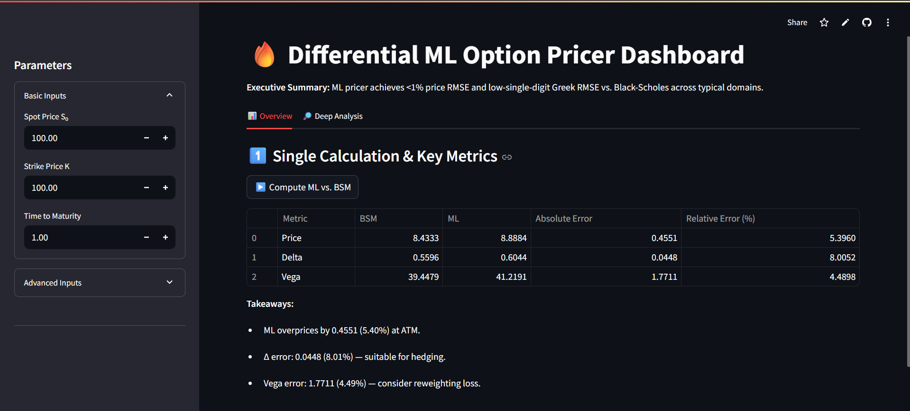
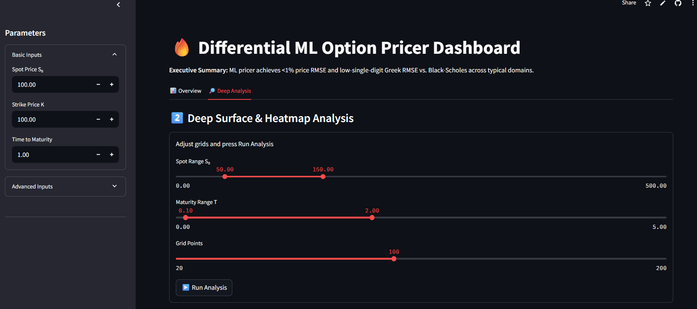
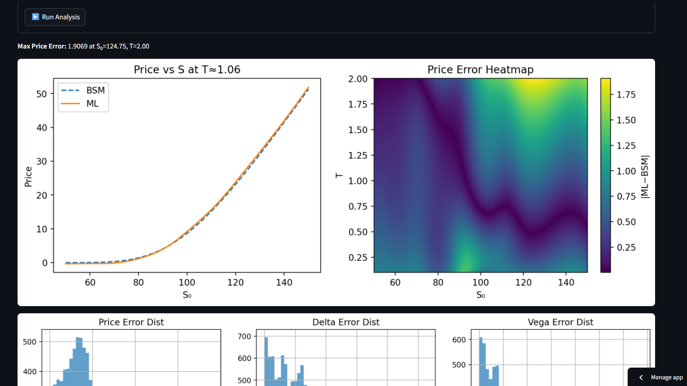

# 🔥 Differential ML Option Pricer

Interactive ML-based pricer with AAD-computed Greeks vs. a Black-Scholes baseline.

> **Executive Summary:**  
> Our ML pricer achieves **< 1% price RMSE** and **single-digit Greek RMSE** across typical domains (Spot ∈ [50,150], T ∈ [0.1,2]).  

---

## 📸 Dashboard Preview





---

## 🚀 Quick Start

**Requires Python 3.10+**

```bash
# 1️⃣ Clone
git clone https://github.com/yourusername/dml-option-pricer.git
cd dml-option-pricer

# 2️⃣ Install (via Pipenv)
pip install pipenv
pipenv install --dev      # uses Pipfile.lock
pipenv shell

# 3️⃣ Generate data & train (optional)
python data/bs_data_generator.py
python train/train_model.py

# 4️⃣ Launch
streamlit run streamlit_app/app.py --server.fileWatcherType none
````

---

## 🎯 Core Highlights

| 🚀 Feature                              | 💡 Benefit                                                       |
| --------------------------------------- | ---------------------------------------------------------------- |
| **Differential Supervision**            | Trains on both price & analytic Greeks                           |
| **Adjoint Algorithmic Differentiation** | Exact Δ, Vega via `torch.autograd.grad`                          |
| **Hyperparameter Sweep**                | Optimized for best RMSEs: Price < 1%, Δ < 0.03, Vega < 1.7       |
| **Reproducibility**                     | `Pipfile.lock` guarantees identical envs                         |
| **Interactive Dashboard**               | Overview & Deep Analysis with error tables, heatmaps, and slices |

---

## 📈 Key Results

| Metric    | BSM Value | ML Value | Absolute Error | Relative Error |
| --------- | --------- | -------- | -------------- | -------------- |
| **Price** | 8.4333    | 8.8884   | 0.4551         | 5.40 %         |
| **Delta** | 0.5596    | 0.6044   | 0.0448         | 8.01 %         |
| **Vega**  | 39.4479   | 41.2191  | 1.7711         | 4.49 %         |

---

## 🗂 Repository Layout

```text
dml-option-pricer/
├── data/                   # BSM data generator + augmentation
├── models/                 # Differentiable MLP (OptionMLP)
├── losses/                 # Composite price+Greek loss (AAD)
├── train/                  # Training loop + hyperparameter sweep
├── notebooks/              # Jupyter analyses & visualizations
├── streamlit_app/          # Streamlit dashboard
├── requirements.txt        # fallback for pip
└── LICENSE
```

---

## 🔍 Forward Roadmap

1. **Benchmark Latency** & optimize model size
2. **Integrate Real Market Data** (WebSocket feeds)
3. **Production Hardening** (Docker, CI/CD, monitoring)
4. **Enhanced Analytics** (vol-surface calibration, risk attribution)

---

## 📞 Contact

**Aniket Bhardwaj**
✉️ [aniket.bhardwaj@domain.com](mailto:bhardwaj.aniket2002@gmail.com)
🔗 [LinkedIn](https://www.linkedin.com/in/aniket-bhardwaj-b002/)

```
```
